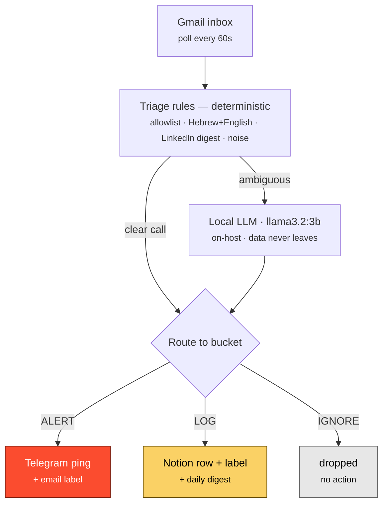

# Recruiter Inbox Triage

Event-driven inbox triage for a job search. It captures recruiter and job emails
(including LinkedIn-via-email), classifies each one with a **local** LLM, and routes
it into three buckets — so the few real signals (a human recruiter, an interview
invite, a rejection that matters) surface instantly, and the noise stays silent.

Built on self-hosted [n8n](https://n8n.io) + a local LLM (Ollama `llama3.2:3b`).
**No email content ever leaves the host** — classification runs on-box.

---

## The problem

A job-search inbox floods with job-alert digests, "application viewed" pings,
newsletters, recruiter pitches, and bot mail. The handful of high-value items get
buried. Manual sweeping doesn't scale. This pipeline does the sweeping.

## Architecture

## How classification works

Two stages, **recall-first** (it is worse to miss a real interview than to over-keep):

1. **Deterministic rules** (cheap, first pass)
   - **Sender allowlist** — known ATS platforms (Greenhouse, Lever, Ashby, Workable,
     Comeet, SparkHire, Workday…) → likely a real recruiter → ALERT candidate.
   - **Recruiter keywords** — Hebrew *and* English (job/role/position, recruiting,
     CV, candidate, opportunity, interview…) → keep.
   - **LinkedIn job-alert digests** (e.g. "24 new jobs match your preferences") → IGNORE.
   - **Noise patterns** (newsletters, marketing, bot mail, unsubscribe footers) → IGNORE.

   This kills roughly **~78% of the inbox** as noise without ever invoking the LLM.

2. **Local LLM** — only the ambiguous middle. A 3B model on the host arbitrates
   `LOG` vs `IGNORE` vs `ALERT`. Free, private, fast enough.

### Three buckets

| Bucket | What | Action |
|---|---|---|
| **ALERT** | human recruiter reply · interview invite · rejection from a real application | instant push notification + email label |
| **LOG** | a real job signal worth keeping (incl. ambiguous — default here, never silently dropped) | database row + email label + one **daily digest** |
| **IGNORE** | job-alert digests · newsletters · marketing · bot mail | dropped |

> The recall-critical path (don't miss an interview) is guarded by the **sender
> allowlist** — rules, not the model. So classification quality can't cause a missed
> interview; worst case is a job-alert mislabeled.

## Privacy-first

- Classification runs **locally** (Ollama). Recruiter names and email bodies are
  **never** sent to a cloud LLM.
- Secrets are injected via environment variables (`TELEGRAM_BOT_TOKEN`,
  `NOTION_TOKEN`, a chat id, a data-source id) — never stored in the workflow.
- The published workflow has all ids/tokens scrubbed to placeholders.

## Notification model

- **ALERT** → instant Telegram (act now).
- **LOG** → filed silently (database + label) → surfaced once a day in a **digest**,
  so nothing slips, without a buzz per job-alert.
- **IGNORE** → gone.

## Stack

| Piece | Role |
|---|---|
| n8n (self-hosted) | orchestration |
| Ollama `llama3.2:3b` | local classifier |
| Gmail API | capture + labels |
| Telegram Bot | instant alerts |
| Notion | the review queue |
| Scheduled job | daily digest of the LOG queue |

## Files

- [`workflow.sanitized.json`](workflow.sanitized.json) — the n8n workflow, with all
  ids/credentials/tokens replaced by `<PLACEHOLDERS>`. Import into n8n, wire your own
  credentials + env, and set the placeholders.

## Design notes

- **Reuse-first.** This is a new *workflow*, not a new service — it composes
  infrastructure that already exists (a local LLM router, a Telegram bot, a Notion
  workspace). A new trigger is not a new pipeline.
- **3 buckets, not 2.** A binary keep/drop forces every ambiguous mail into a guess.
  The third bucket (LOG) is the safe default for "unsure," keeping the dangerous
  false-negative rate near zero.

## License

MIT — see [LICENSE](LICENSE).
